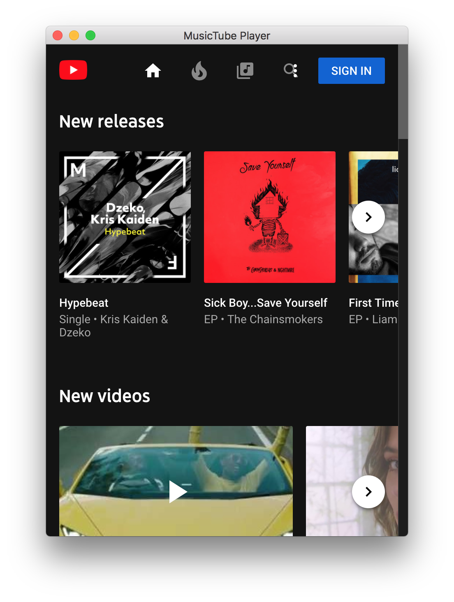

# MusicTube Player

MusicTube is an unofficial YouTube Music Desktop app, with some additions that I feel necessary, notably media keys and system notifications.

## Technical

Built using [ElectronJS](https://electronjs.org/). 
Tested & built on OSX (10.13.6)

---

## Install

Download the latest release here.
https://github.com/simon-fraser/MusicTube-Player/releases

-- or --

Clone the repository and run `npm build` with [electron-packager](https://github.com/electron-userland/electron-packager) installed.

---

## Issues

Issues can be logged on GitHub here. https://github.com/simon-fraser/MusicTube-Player/issues

## Todo

- [X] Notifications on track change,play/pause.
- [X] About Page
- [ ] ~~Update <https://github.com/jenslind/electron-gh-releases>~~
- [ ] Releases for other operating systems.

---

### Acknowledgments & Contributions

Icon [Designed by rocketpixel / Freepik](http://www.freepik.com)

### Screenshots

